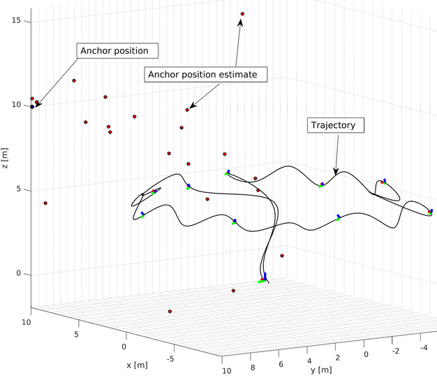
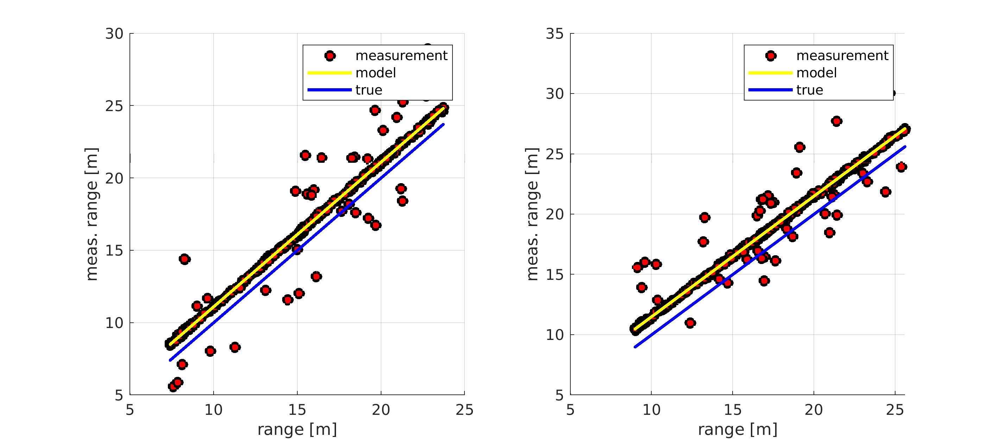

# (Meshed) UWB Anchor Initialization Framework

| Trajectory | Measurements |
|:----------|:-------------|
|  |  

### Build

1. The C++ stand-alone library can also be builded and installed with:
```[bash]
cd uwb_init_lib
mkdir build && cd build
cmake ../
cmake --build .
sudo cmake --install .
```

## Usage

The objective is to initialize a set of unknown UWB anchors. To understand the motivation and the detailed initialization procedure
please refer to the [academic paper].

An example command line tool with sample data is provided. Run it e.g. with :
```cmd
uwb_init_cmd --use_nls_ransac --use_ls_ransac --enable_ls --sigma_pos 0.1 --sigma_range 0.1 --uwb_meas_csv ./uwb_init_lib/examples/cmd/data/DS_TWR_range_outliers_0.15_noise_d0.1_noise_T0.01.csv --tag_pos_csv ./uwb_init_lib/examples/cmd/data/DS_TWR_pos_sigma_T0.01.csv
```

