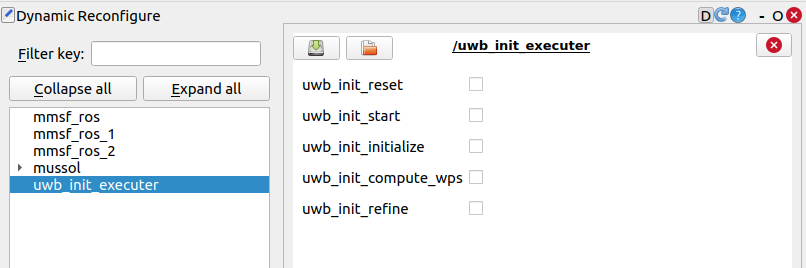

# uwb_init_trigger


A ROS1 package to trigger the [UWB initialization library](https://github.com/aau-cns/uwb_init) explained in the paper UVIO: An UWB-Aided Visual-Inertial Odometry Framework with Bias-Compensated Anchors Initialization (https://arxiv.org/abs/2308.00513).
This is node utilizes features from the [ros_common package](https://gitlab.aau.at/aau-cns/ros_pkgs/ros_common)

Maintainers: [Roland Jung](mailto:roland.jung@aau.at) 

## Credit

This code was written by the [Control of Networked System (CNS)](https://www.aau.at/en/smart-systems-technologies/control-of-networked-systems/), 
University of Klagenfurt, Klagenfurt, Austria.

## License

This software is made available to the public to use (_source-available_), licensed under the terms of the BSD-2-Clause-
License with no commercial use allowed, the full terms of which are made available in the `LICENSE` file. No license in
patents is granted

## Getting Started

The main folder constains the C++ library and its ROS wrapper.

### Prerequisites

1. Create a catkin workspace and install [catkin_tools](https://catkin-tools.readthedocs.io/en/latest/installing.html)
    ```[bash]
    mkdir -p catkin_ws/src && cd catkin_ws
    sudo apt update && sudo apt install -y python3-catkin-tools
    catkin init
    catkin config --extend /opt/ros/$(rosversion -d) --cmake-args -DCMAKE_BUILD_TYPE=Release -j4 -l4
    ```
2. Clone the required ROS packeges to your workspace
    ```[bash]
    cd src
    git clone git@gitlab.aau.at:aau-cns/ros_pkgs/ros_common.git
    git clone git@gitlab.aau.at:aau-cns/ros_pkgs/uwb_msgs.git    
    git clone git@gitlab.aau.at:aau-cns/ros_pkgs/uwb_init_cpp.git
    ```


### Usage

Either use:
1) the dynamic reconfiguration gui,



2) enable the `auto_trigger` with a timeout for starting and stopping the recording in the launch file.
3) a `std_msgs::Bool` on the `/start` and `/init` topics.
